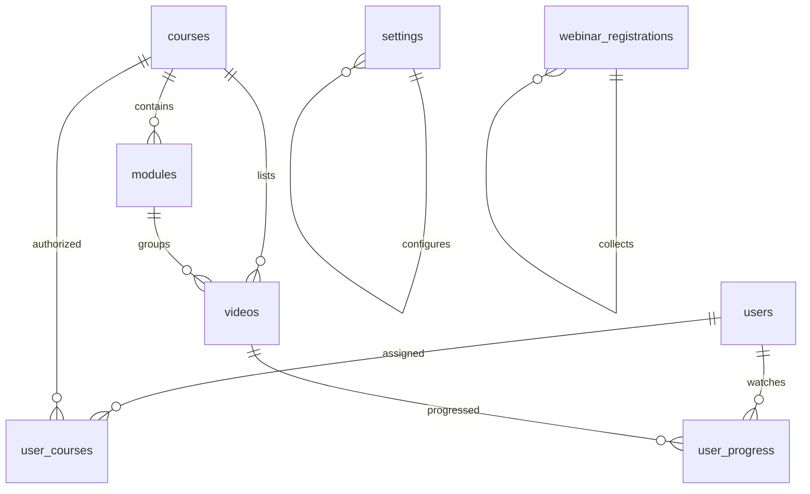

# 🔥 Burn IT Out Fitness — Next.js Performance Intelligence Platform

> **A secure, advanced Next.js athlete-tracking, workout curriculum management, and custom video-learning portal tailored for Burn IT Out Fitness.**

---

## 📖 Table of Contents
1. [🌟 Platform Overview](#-platform-overview)
2. [✨ Core Features](#-core-features)
   - [Landing & Public Experience](#1-landing--public-experience)
   - [Athlete Student Dashboard](#2-athlete-student-dashboard)
   - [Advanced Admin Console](#3-advanced-admin-console)
   - [Adaptive Theme Engine](#4-adaptive-theme-engine)
3. [🛠️ Technical Architecture & Stack](#%EF%B8%8F-technical-architecture--stack)
4. [📁 Database Schema & Relationships](#-database-schema--relationships)
5. [🌿 Folder Structure](#-folder-structure)
6. [🚀 Quick-Start & Installation Guide](#-quick-start--installation-guide)
   - [Prerequisites](#prerequisites)
   - [1. Clone & Install](#1-clone--install)
   - [2. Database Initialization](#2-database-initialization)
   - [3. Run Migrations](#3-run-migrations)
   - [4. Environment Variables](#4-environment-variables)
   - [5. Run Local Server](#5-run-local-server)
   - [Default Accounts for Testing](#default-accounts-for-testing)
7. [🛡️ Security & Access Control](#%EF%B8%8F-security--access-control)
8. [📈 Advanced Customizations & Scripts](#-advanced-customizations--scripts)

---

## 🌟 Platform Overview

**Burn IT Out Fitness** is an enterprise-grade, high-fidelity wellness and training education platform. Designed for modern coaches and dedicated athletes, the system solves two major challenges in digital fitness training:
1. **Access Management:** Ensuring that only enrolled students can view proprietary workout plans, training guides, and high-quality instructional videos.
2. **Progress Intelligence:** Tracking which video lessons are watched, displaying visual progress rings, and offering admins a unified control dashboard to manage athletic rosters, assignments, and webinar channels.

The user interface uses a striking, HSL-tailored, brutalist-modern style with vibrant orange gradients (`#ff5e00` to `#ff3c00`), elegant glassmorphism, responsive bento grids, and fluid layout typography using the *Montserrat* Google Font.

---

## ✨ Core Features

### 1. Landing & Public Experience
- **Webinar Registration Matrix:** Includes an interactive, high-visibility "Live Webinar" broadcast invitation card on the homepage, allowing public visitors to register for upcoming streams.
- **Intro Video Spotlight:** Engaging video player showcases metabolic conditioning principles.
- **Coach Spotlight:** Visual profile highlighting certified credentials, women's training focus, and core recovery specialization.
- **Instagram Social Stream:** A custom visual feed reflecting daily training updates, athletic transformations, and motivation.
- **Dynamic Community Callouts:** Direct options to register for live events and instantly join private training chats.

### 2. Athlete Student Dashboard
- **Performance Intelligence AI:** Visual gauge tracking active program progress percentage, milestone trackers, and video-by-video indicators.
- **Proprietary Curriculum Feed:** Multi-program student navigation selector showcasing active modules, locks on unassigned materials, and completion badges.
- **Fluid Video Player:** YouTube player integrated directly with progress synchronization. When a video lesson concludes, the database dynamically logs the milestone, increments progress stats, and transitions to the next lesson.
- **Bento Utility Grid:** Downloadable Study Guides and Biomechanical Checklists, Knowledge Quizzes (unlocked via foundation tests), and real-time athletic community updates.
- **Private Communication Links:** Custom Whatsapp group integration and direct support coach ticketing systems.

### 3. Advanced Admin Console
The admin panel hosts **6 interactive workspaces** enabling full control over platform operations:
1. **User Management:** Oversee system roles, register new student profiles, search/filter athletes, and suspend or activate accounts in real-time.
2. **Workouts & Program Builder:** Author, update, or remove metabolic conditioning program headers, descriptions, and durations.
3. **Video Lesson uploader:** Directly register new YouTube video lessons, configure sequence ordering (`order_index`), and bind them to specific training modules.
4. **Assignment Matrix:** Restrict course visibility. Only courses explicitly assigned by the administrator will populate on that athlete's student dashboard.
5. **Webinar Lead Analytics:** List names, emails, age, phone numbers, geographical regions, and custom goals submitted by public webinar registrants with excel-friendly exporting capabilities.
6. **Global System Settings:** Update active webinar Zoom links, private community WhatsApp chat links, and dynamic webinar dates/times across the landing pages.

### 4. Adaptive Theme Engine
- **Dark Mode & Light Mode:** Both the Administrator Console and the Student Dashboard support fully dynamic dark and light mode themes.
- **Persistent Choice:** Layout modes are saved in local storage (`db-theme`, `adm-theme`) for persistent, seamless user sessions.

---

## 🛠️ Technical Architecture & Stack

| Component | Technology | Role |
| :--- | :--- | :--- |
| **Framework** | Next.js 15.5+ (App Router) | High-speed server-side rendering (SSR), static optimization, and unified API endpoints. |
| **Runtime** | React 18.3 & React DOM | High-fidelity component rendering and interactive states. |
| **Styling** | Pure Vanilla CSS (Variables) | Tailored HSL variable tokens, glassmorphism, responsive grid sheets, and animations without external style compiler footprint. |
| **Database** | MySQL 8.0+ | Structured schema management for users, courses, assignments, and progress. |
| **DB Client** | `mysql2/promise` | Connection pooling and high-speed parameterized asynchronous SQL queries. |
| **Security** | HTTP-Only JSON Web Tokens (JWT) | Safe cookie-based session verification with fallback bearer authorization. |
| **Password Crypt**| `bcryptjs` | 10-round salted cryptography for secure password hashing. |
| **Icons** | `lucide-react` | Clean, premium vector iconography. |
| **Data Export** | `xlsx` | Formatted Excel-based lead sheet generation from the admin console. |

---

## 📁 Database Schema & Relationships

The database is built on **7 central tables** managed inside MySQL with strict foreign key constraints to prevent orphan rows.



### Table Details

#### 1. `users`
Registered users holding system credentials and functional roles.
*   `id` `INT` (PK, Auto-Increment)
*   `name` `VARCHAR(255)` — User's name
*   `email` `VARCHAR(255)` (Unique) — Authentication email
*   `password` `VARCHAR(255)` — Salted bcrypt password hash
*   `role` `ENUM('admin', 'user')` — System access permission
*   `is_active` `TINYINT(1)` (Default: 1) — Suspended vs Active status
*   `created_at` `TIMESTAMP` — Roster creation timestamp

#### 2. `courses`
Core workout programs curated on the platform.
*   `id` `INT` (PK, Auto-Increment)
*   `title` `VARCHAR(255)` — Program name
*   `description` `TEXT` — Curriculum description
*   `duration` `VARCHAR(255)` — Program span (e.g., "6 Weeks")
*   `includes` `TEXT` — Program takeaways
*   `image` `VARCHAR(255)` — Thumbnail image path
*   `recommended` `TINYINT(1)` — Promoted flag
*   `created_at` `TIMESTAMP`

#### 3. `modules`
Chapters or weekly divisions partitioning workout courses.
*   `id` `INT` (PK, Auto-Increment)
*   `course_id` `INT` (FK -> `courses.id`, Cascades on delete)
*   `title` `VARCHAR(255)` — Chapter title
*   `order_index` `INT` — Sorting priority sequence

#### 4. `videos`
Individual instructional video lessons.
*   `id` `INT` (PK, Auto-Increment)
*   `course_id` `INT` (FK -> `courses.id`, Nulls on delete)
*   `module_id` `INT` (FK -> `modules.id`, Nulls on delete)
*   `title` `VARCHAR(255)` — Lesson name
*   `youtube_id` `VARCHAR(255)` — Standard 11-char YouTube unique video ID
*   `order_index` `INT` — Sequence priority

#### 5. `user_courses`
 Roster assignment ledger mapping authorized programs to students.
*   `id` `INT` (PK, Auto-Increment)
*   `user_id` `INT` (FK -> `users.id`, Cascades on delete)
*   `course_id` `INT` (FK -> `courses.id`, Cascades on delete)
*   `assigned_at` `TIMESTAMP`
*   *Unique Key:* `(user_id, course_id)`

#### 6. `user_progress`
Milestone tracker logging watched video list.
*   `user_id` `INT` (FK -> `users.id`, Cascades on delete)
*   `video_id` `INT` (FK -> `videos.id`, Cascades on delete)
*   `watched_at` `TIMESTAMP`
*   *Unique Key:* `(user_id, video_id)`

#### 7. `settings`
KeyValue registry for global, editable platform values.
*   `key_name` `VARCHAR(100)` (PK) — Configuration key name
*   `value` `TEXT` — Configuration string value
*   `updated_at` `TIMESTAMP`

#### 8. `webinar_registrations`
Public lead generation register.
*   `id` `INT` (PK, Auto-Increment)
*   `name` `VARCHAR(255)` — Registrant name
*   `email` `VARCHAR(255)` — Contact email
*   `age` `INT` — Registrant age
*   `phone` `VARCHAR(50)` — Contact phone number
*   `region` `VARCHAR(255)` — Geolocation / state
*   `message` `TEXT` — Personal transformation targets
*   `created_at` `TIMESTAMP`

---

## 🌿 Folder Structure

```ansi
Burn-IT-NxT/
├── app/                        # Next.js App Router root
│   ├── about/                  # About page path
│   ├── admin/                  # Administrative Workspace Console
│   ├── api/                    # Dynamic Serverless API Endpoints
│   │   ├── admin/              # Admin exclusive actions (assignments, registrations, user settings)
│   │   ├── auth/               # Google OAuth integrations
│   │   ├── courses/            # Public/Protected course metadata getters
│   │   ├── login/              # JWT-enforced email credentials evaluator
│   │   ├── logout/             # HTTP-only cookie invalidator
│   │   ├── settings/           # Webinar settings manager
│   │   ├── user/               # Student specific progress trackers & courses list
│   │   └── video/              # Video ID resolver (protected)
│   ├── blog/                   # Public blog pages
│   ├── contact/                # Contact channels page
│   ├── dashboard/              # Student Learning Hub (Performance Tracking, Video Curriculum Player)
│   ├── login/                  # Authentication layout
│   ├── programs/               # General fitness programs catalog
│   ├── success-stories/        # Success transformations carousel
│   ├── globals.css             # Main styling, design system tokens, and theme stylesheets
│   ├── layout.js               # Main viewport and navigation wrapper
│   └── page.js                 # Landing Page layout
├── components/                 # Shared Reusable UI Components
│   ├── CommunitySection.js     # Live webinar promotion, registration logic & community links
│   ├── Footer.js               # Site navigation footer
│   ├── GoogleProvider.js       # Third-party credentials provider
│   ├── Header.js               # Sticky navigation header
│   ├── Hero.js                 # High impact hero section with interactive live webinar card
│   ├── InstagramFeed.js        # Mock Instagram feed
│   ├── IntroVideo.js           # Public Intro Video element
│   ├── ProgramCard.js          # Core course visual card
│   ├── scrollcards.js          # Infinite training cards carousel
│   └── VideoPlayer.js          # Protected HTML5/YouTube wrapper with email watermark & video events tracker
├── database/                   # Seed & SQL management
│   └── schema.sql              # Clean SQL database structural setup
├── lib/                        # Framework Helper Core
│   ├── auth.js                 # JWT encoder/decoder & authorization middleware checks
│   └── db.js                   # mysql2 connection pool manager
├── scripts/                    # Platform database updates and checking tools
│   ├── check-users.js          # Check currently registered user rosters
│   ├── check-videos.js         # Confirm video bindings in SQL
│   ├── fix-courses-table.js    # Database repair tool for courses
│   └── migrate_webinar.js      # Creates webinar registrations registry table
├── middleware.js               # Next.js route protection and redirection middleware
├── migrate.js                  # Settings schema deployment script
├── next.config.mjs             # Next.js bundler config
├── package.json                # Project script registry & lock-in dependencies
└── README.md                   # Platform documentation
```

---

## 🚀 Quick-Start & Installation Guide

Follow these steps to deploy a localized version of Burn IT Out Fitness on your local system:

### Prerequisites
- **Node.js:** v18.0.0 or higher
- **MySQL Database Server:** v8.0 or higher

---

### 1. Clone & Install
Clone the repository and install all node packages:
```bash
git clone <your-repository-url>
cd Burn-IT-NxT
npm install
```

---

### 2. Database Initialization
Open your MySQL client shell (or tools like MySQL Workbench, phpMyAdmin, DBeaver) and create the main system database:
```sql
CREATE DATABASE burnit_db CHARACTER SET utf8mb4 COLLATE utf8mb4_unicode_ci;
```

Run the schema configuration scripts to seed default tables and insert base rows:
```bash
mysql -u root -p burnit_db < database/schema.sql
```
*(You will be prompted to input your MySQL root account password)*

---

### 3. Run Migrations
Run the database migrations to deploy the dynamic webinar registers and settings table entries:
```bash
# Run system setting entries initialization
node migrate.js

# Deploy webinar registration tables
node scripts/migrate_webinar.js
```

---

### 4. Environment Variables
Create an environment file inside the project root:
```bash
cp .env.example .env.local
```

Open `.env.local` inside your text editor and specify the local database credentials and JWT Secret key:
```env
DB_HOST=localhost
DB_PORT=3306
DB_USER=root
DB_PASSWORD=your_mysql_root_password
DB_NAME=burnit_db

# Choose any long, secure string for signing session JWT tokens
JWT_SECRET=super_long_random_and_secure_secret_hash_key_123!
```

---

### 5. Run Local Server
Launch the development server:
```bash
npm run dev
```

Open your browser to [http://localhost:3000](http://localhost:3000) to view the landing page!

---


## 🛡️ Security & Access Control

1.  **Middleware Handshake:** The application utilizes standard `middleware.js` matching pattern guards. If a request is targeted towards `/dashboard`, `/admin`, `/api/admin`, or `/api/user`, the middleware inspects the request cookies for a valid `token`.
2.  **JWT Verification:** If a token is detected, it is parsed and verified securely.
    - If a non-logged-in user requests `/dashboard` or `/admin`, they are automatically redirected to `/login`.
    - If an authenticated user attempts to access `/login`, they are redirected to their active dashboard.
3.  **Role Enforcement:** If the route begins with `/admin` or `/api/admin`, the middleware decodes the payload parameters. If the `role` value does not match `'admin'`, the user is instantly redirected to the standard `/dashboard` (or blocked with a `403 Forbidden` API status).
4.  **HTTP-Only Cookies:** Tokens are set in the client's browser with `HttpOnly`, `Secure` (in production), and `SameSite=Strict` policies, protecting the session from XSS hijacking.

---

## 📈 Advanced Customizations & Scripts

Inside the `scripts` folder, several standalone utilities are present to aid administrative workflows during local development:

- **Check Current Users:**
  ```bash
  node scripts/check-users.js
  ```
  Outputs currently registered users and their details inside the command line.

- **Check Videos Mapping:**
  ```bash
  node scripts/check-videos.js
  ```
  Verifies YouTube IDs and descriptions mapped in the database tables.

- **Repair/Fix Courses:**
  ```bash
  node scripts/fix-courses-table.js
  ```
  A database utility script used to re-align course columns or rebuild indices if database schema collisions occur.
